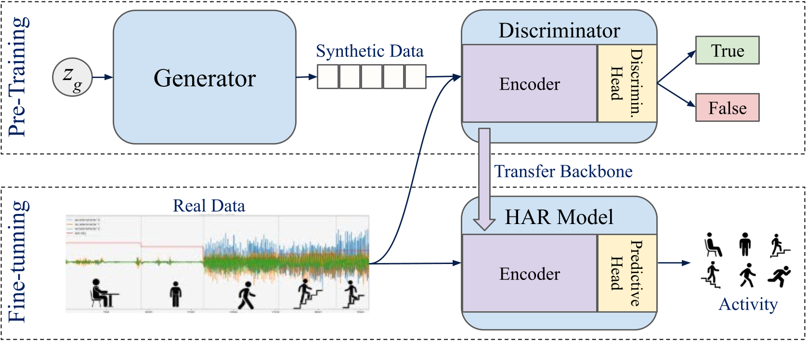

# Assessing GANs as a Self-Supervised Learning Technique for Time-Series

This repository contains the implementation and experimental analysis presented in the paper:

**"Assessing GANs’ Effectiveness for Time Series Representation Learning"**

---

## Overview

This project investigates the use of **Generative Adversarial Networks (GANs)** as a **self-supervised learning (SSL)** strategy for time-series representation learning, with a focus on **Human Activity Recognition (HAR)** tasks.

We compare two GAN-based approaches:

- **TCGAN** (CNN-based) ([Original Implementation](https://arxiv.org/abs/2309.04732))
- **TTSGAN** (Transformer-based) ([Original Implementation](https://arxiv.org/abs/2202.02691))

against well-established SSL methods:

- **TFC (Time-Frequency Consistency)** ([Original Implementation](https://arxiv.org/abs/2206.08496))
- **LFR (Learning From Randomness)** ([Original Implementation](https://arxiv.org/abs/2310.07756v2))

The key idea is that, instead of using GANs solely for data generation, we leverage the **discriminator as a feature extractor**:

1. Train a GAN using adversarial learning  
2. Extract the encoder from the discriminator  
3. Fine-tune it on a downstream classification task  

This reframes GANs as a **self-supervised pretraining method**.

---

## Methodology

### Training Pipeline

<p align="center" style="background-color:white; padding:10px;">
  
</p>

### Architectures

- **TCGAN**
  - Convolutional backbone  
  - Strong modeling of local temporal dependencies  
  - More stable adversarial training  

- **TTSGAN**
  - Transformer backbone  
  - Captures long-range dependencies  
  - Higher representational capacity  

---

## Datasets

Experiments were conducted on the **DAGHAR benchmark**, including:

- KuHAR  
- MotionSense  
- UCI  
- WISDM  
- RealWorld (Thigh & Waist)  

All datasets were:

- Resampled to **20 Hz**  
- Segmented into **3-second windows**  

| Dataset | Train | Validation | Test |
|--------|------:|-----------:|-----:|
| KH     | 1386  | 426        | 144  |
| MS     | 3558  | 420        | 1062 |
| RW-T   | 8400  | 1764       | 2628 |
| RW-W   | 10332 | 1854       | 2592 |
| UCI    | 2420  | 340        | 690  |
| WDM    | 8736  | 944        | 2596 |

---

## Experimental Setup

- Pretraining: 100 epochs  
- Fine-tuning: 100 epochs  
- Optimizer: Adam  
- Learning rate: 1e-3  

Evaluation was performed across:

- Low-data regimes (1–200 samples per class)  
- Full dataset  
- Both **freeze** and **full fine-tuning** protocols  

---

## Results Summary

### Main Findings

- GANs are an **effective** SSL method for time-series representation learning  
- **TCGAN consistently outperforms TTSGAN** across most settings  
- **TFC achieves the best overall performance**, although TCGAN remains competitive  
- The **TFC extended backbone significantly improves TTSGAN**, highlighting the importance of architectural design  

All results can be explored in the [Results.html](Results.html) file.

---

### Quantitative Results


| Dataset | Samples per class | LFR | TCGAN | TFC | TTSGAN |
|--------|:----------------:|-----|-------|-----|--------|
| KH | 001 | 0.368 ± 0.061 | 0.460 ± 0.038 | **0.487 ± 0.095** | 0.350 ± 0.041 |
| KH | 010 | 0.472 ± 0.089 | 0.582 ± 0.055 | **0.681 ± 0.092** | 0.422 ± 0.038 |
| KH | 100 | 0.475 ± 0.018 | 0.489 ± 0.052 | 0.526 ± 0.136 | **0.560 ± 0.053** |
| KH | max | **0.711 ± 0.056** | 0.635 ± 0.049 | 0.654 ± 0.032 | 0.600 ± 0.055 |
| MS | 001 | 0.249 ± 0.059 | **0.563 ± 0.020** | 0.441 ± 0.031 | 0.324 ± 0.050 |
| MS | 010 | 0.436 ± 0.059 | **0.737 ± 0.031** | 0.661 ± 0.038 | 0.489 ± 0.046 |
| MS | 100 | 0.855 ± 0.043 | **0.909 ± 0.013** | 0.853 ± 0.025 | 0.743 ± 0.035 |
| MS | max | 0.886 ± 0.052 | 0.915 ± 0.041 | **0.917 ± 0.024** | 0.806 ± 0.025 |
| RW-T | 001 | 0.277 ± 0.042 | 0.385 ± 0.023 | **0.442 ± 0.039** | 0.323 ± 0.046 |
| RW-T | 010 | 0.508 ± 0.039 | 0.590 ± 0.058 | **0.605 ± 0.036** | 0.446 ± 0.042 |
| RW-T | 100 | 0.673 ± 0.022 | 0.676 ± 0.006 | **0.705 ± 0.023** | 0.633 ± 0.026 |
| RW-T | max | 0.705 ± 0.015 | 0.652 ± 0.017 | **0.745 ± 0.016** | 0.671 ± 0.043 |
| RW-W | 001 | 0.348 ± 0.076 | 0.486 ± 0.035 | **0.539 ± 0.022** | 0.266 ± 0.039 |
| RW-W | 010 | 0.628 ± 0.012 | 0.598 ± 0.041 | **0.632 ± 0.017** | 0.545 ± 0.033 |
| RW-W | 100 | **0.706 ± 0.016** | 0.657 ± 0.032 | 0.702 ± 0.018 | 0.674 ± 0.015 |
| RW-W | max | **0.749 ± 0.033** | 0.728 ± 0.040 | 0.706 ± 0.037 | 0.700 ± 0.024 |
| UCI | 001 | 0.426 ± 0.062 | **0.596 ± 0.051** | 0.497 ± 0.043 | 0.392 ± 0.075 |
| UCI | 010 | 0.731 ± 0.017 | 0.779 ± 0.010 | **0.782 ± 0.013** | 0.614 ± 0.051 |
| UCI | 100 | 0.828 ± 0.014 | **0.870 ± 0.055** | 0.856 ± 0.037 | 0.790 ± 0.009 |
| UCI | max | 0.959 ± 0.006 | **0.971 ± 0.003** | 0.961 ± 0.005 | 0.879 ± 0.034 |
| WDM | 001 | 0.278 ± 0.044 | 0.544 ± 0.037 | **0.554 ± 0.034** | 0.376 ± 0.070 |
| WDM | 010 | 0.644 ± 0.022 | 0.725 ± 0.014 | **0.737 ± 0.015** | 0.552 ± 0.079 |
| WDM | 100 | 0.789 ± 0.014 | **0.821 ± 0.020** | 0.807 ± 0.022 | 0.713 ± 0.016 |
| WDM | max | **0.883 ± 0.004** | 0.871 ± 0.012 | 0.882 ± 0.006 | 0.863 ± 0.005 |


- TFC corresponds to the CNNPFF-pretrained model using only the time encoder for fine-tuning; 
- All models were evaluated under full fine-tuning, with TFC and LFR using the CNNPFF backbone (best in DAGHAR), while GAN-based methods use their native architectures.

---

## Challenges

- GAN instability (e.g., mode collapse)  
- Sensitivity of transformer-based models  
- Difficulty in cross-backbone integration  

---

## Future Work

- Improve adversarial training stability  
- Explore alternative loss functions (e.g., WGAN-GP)  
- Investigate cross-dataset generalization  
- Refine transformer-based architectures  

---

## Citation

If you use this work:

```bibtex
@article{gan_ssl_timeseries,
  title={Assessing GANs’ effectiveness for Time Series Representation Learning},
  author={},
  year={2026}
}